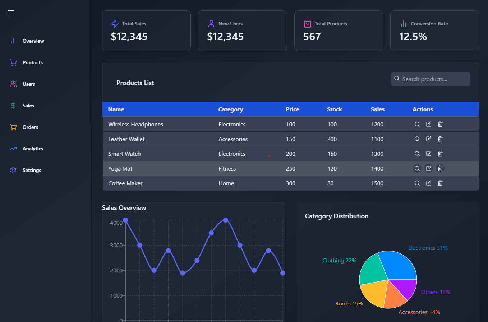

# Admin Dashboard Frontend

  
_Add a screenshot of your dashboard here_

## 🚀 Project Overview
This is a **modern and responsive Admin Dashboard** built using **React, Tailwind CSS, and Material UI**. It provides a clean and professional UI for managing different aspects of an application.

## 📌 Features
- **Overview Page** - Summarized insights of the system.
- **Products Management** - View, add, update, and delete products.
- **Users Management** - Manage user details and roles.
- **Sales Analytics** - Graphs and charts for sales trends.
- **Orders** - Track and manage customer orders.
- **Analytics** - Insights into business performance.
- **Settings** - Customize admin panel settings.

## 🛠️ Technologies Used
- **React.js** - Frontend framework
- **Tailwind CSS** - Utility-first styling
- **Material UI** - Pre-designed UI components

## 📂 Project Setup
Follow these steps to run the project locally:

1. Clone the repository:
   ```sh
   git clone <repository_url>
   ```
2. Navigate to the project folder:
   ```sh
   cd admin-dashboard
   ```
3. Install dependencies:
   ```sh
   npm install
   ```
4. Start the development server:
   ```sh
   npm run dev
   ```
5. Open in browser:
   ```
   http://localhost:5173
   ```

## 📸 Screenshots




## 🤝 Contributing
Contributions are welcome! Feel free to submit issues or pull requests.

## 📜 License
This project is **open-source** and available under the MIT License.

---
💡 **Built with passion by Mijanur Rahman Mijan**

